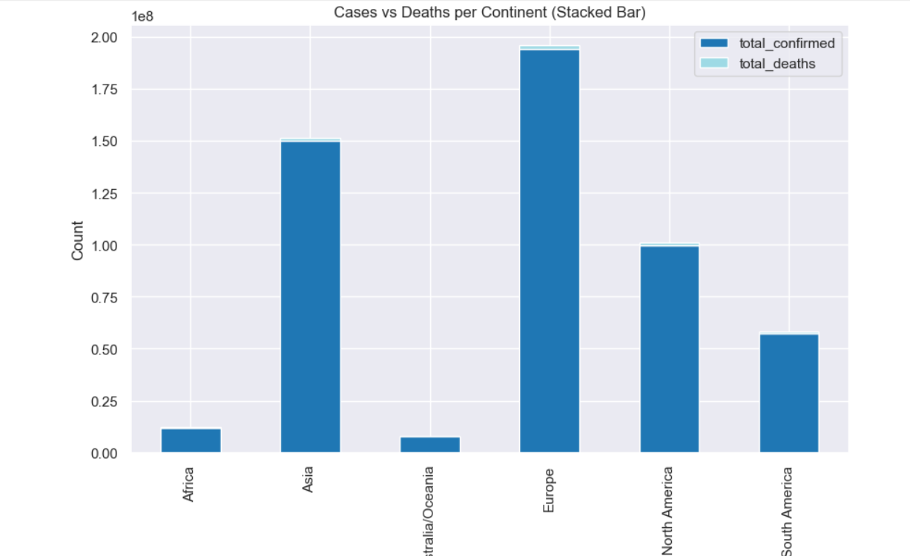
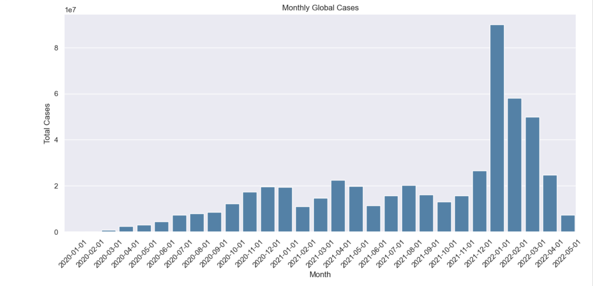
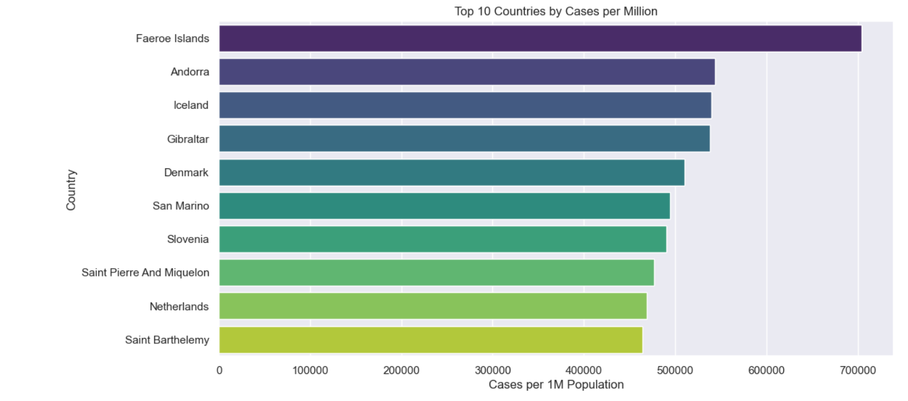

# 🦠 COVID-19 Data Analysis & Visualization Dashboard


This project provides **insights into the spread, impact, and trends of COVID-19** across different countries.  
Using **Python, Pandas, Matplotlib, and Seaborn**, we analyze and visualize the pandemic data with engaging plots and statistics.

---

## 📊 Visualizations

Here are some of the plots generated in this project:

### Cases and Deaths Trends


### Daily New Cases


### Active Cases Distribution


---

## ⚙️ Tech Stack

- **Python 3.x**
- **Jupyter Notebook**
- **Pandas** (data analysis)
- **Matplotlib** (visualization)
- **Seaborn** (visualization)
- **NumPy** (numerical computations)

---

## 🚀 Features

✔️ Analyze COVID-19 trends by country and globally  
✔️ Calculate daily new cases and deaths  
✔️ Visualize active vs. cumulative cases  
✔️ Interactive plots for better understanding  

---

## 📂 Project Structure

```
├── data/                 # Raw data files (CSV, Excel, etc.)
├── plots/                # Generated plots (plot-1.png, plot-2.png...)
├── notebooks/            # Jupyter Notebooks with code
├── requirements.txt      # Project dependencies
├── .gitignore            # Ignored files for Git
└── README.md             # Project documentation
```

---

## 👨‍💻 Author

**Rishavdeep Maity**  
📧 rishavdeep.skills@gmail.com  
🔗 [LinkedIn](https://www.linkedin.com/in/rishav05112003)  

---

## 🌟 Contributing

Pull requests are welcome! For major changes, please open an issue first to discuss what you’d like to change.

---

## 📜 License

This project is licensed under the MIT License.


